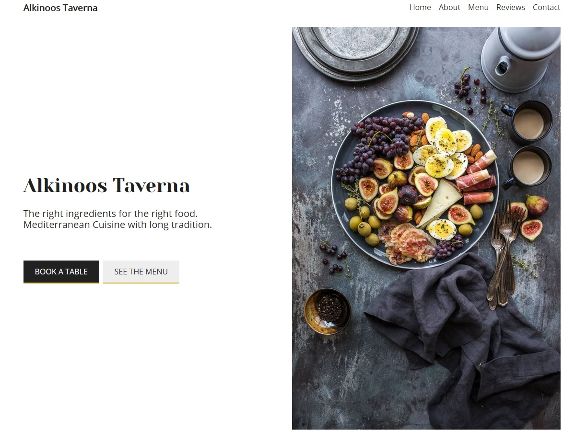

# Alkinoos Taverna
[](https://standardjs.com)
[Live version on Netlify](https://alkinoos-taverna.netlify.com/ "Live version on Netlify")  
Fully responsive, serverless, restaurant progressive web app using React.js, where user can easily create a booking. There is also administrating panel for restaurant staff.
Available routes:
- `/menu`
- `/login`
- `/admin`
- `/book-table`

## Table of contents
* [Technologies](#technologies)
* [Setup](#setup)
* [Used packages and tools](#used-packages-and-tools)
* [Work in progress](#work-in-progress)


## Technologies

- React.js 16.5.2
- Redux
- React hooks
- Scss
- JavaScript ES6
- Firebase Firestore
- Netlify
- Jest - [Delightful JavaScript Testing Framework](https://jestjs.io/)
- Photos from [Brooke Lark](http://brookelark.com/) on [Unsplash](https://unsplash.com/@brookelark)


## Setup

```bash
  git clone https://github.com/Verthon/restaurant-app.git
  npm install
  npm start
```

## Used packages and tools

- Datepicker for React [React Datepicker](https://github.com/Hacker0x01/react-datepicker)
- React notifications [React Toastify](https://github.com/fkhadra/react-toastify)
- Awesome tool for managing color variables [ColorNamer](https://colornamer.netlify.com/)


## Work in progress

- [x] Refactor CSS BEM classes
- [x] Show modal after confirming reservation
- [x] Send all data(order) to Firebase
- [x] Jest Unit testing
- [x] Add PWA support
- [ ] Add Sending email support
- [ ] Add backend MERN stack
- [ ] Serve images in next-gen formats