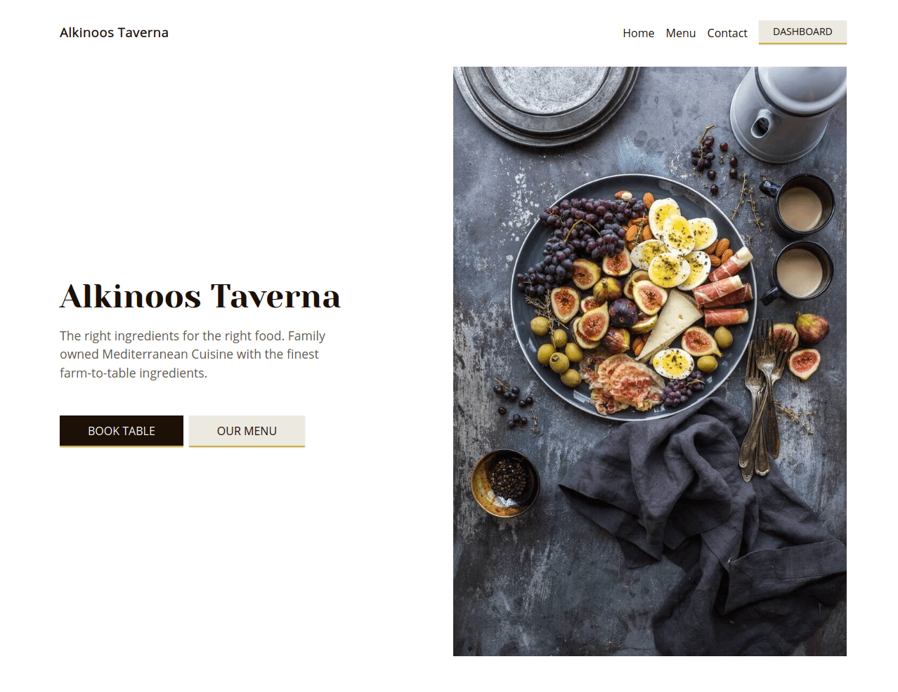

# Alkinoos Taverna

[](https://standardjs.com)

Fully responsive restaurant web app using Next.js, where user can easily create a booking. There is also administrating panel for restaurant staff in /admin. I have used photos by [Brooke Lark](http://brookelark.com/) available on [Unsplash](https://unsplash.com/@brookelark)

## Live

[alkinoos-taverna](https://alkinoos-taverna.vercel.app/)

## Table of contents

- [Technologies](#technologies)
- [Setup](#setup)

## Technologies

- Next.js
- Scss
- Typescript
- Supabase
- Continuous Deployment with Vercel
- React Testing Library and Jest
- Git hooks powered by husky (pre-commit and pre-push)

## Setup

Vercel still has no support for Node 16 so fo now sticking with 14 LTS
https://github.com/vercel/vercel/discussions/7003

- You need to have node 14 LTS installed to run this project
- If you run into issues with node-sass, try `npm rebuild node-sass` command

```bash
  clone repo
  create account Supabase
  create account on Emailjs
  follow the env setup listed in env.example
  npm install
  npm start
```
