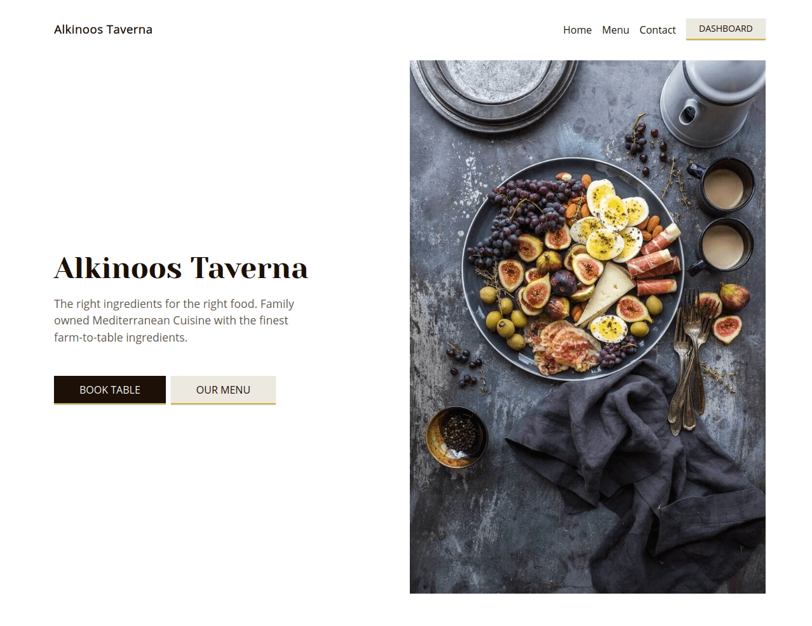

# Alkinoos Taverna

The legacy version with firestore

[](https://standardjs.com)
[](https://app.netlify.com/sites/alkinoos-taverna/deploys)
Fully responsive, serverless, restaurant progressive web app using React.js, where user can easily create a booking. There is also administrating panel for restaurant staff in /admin. I have used photos by [Brooke Lark](http://brookelark.com/) available on [Unsplash](https://unsplash.com/@brookelark)
Available routes:

- `/menu`
- `/login`
- `/admin`
- `/book-table`

## Live 📍

[Live version on Netlify](https://alkinoos-taverna.netlify.com/ "Live version on Netlify")

## Table of contents

- [Technologies](#technologies)
- [Setup](#setup)
- [Used packages and tools](#used-packages-and-tools)

## Technologies

- React.js
- React Router
- Scss
- Firebase Firestore
- Continuous Deployment with Netlify
- React Testing Library and Jest
- Prettier
- ESLint
- Day.js

## Setup

- You need to have node 10 LTS installed to run this project
- If you run into issues with node-sass, try `npm rebuild node-sass` command

```bash
  git clone https://github.com/Verthon/restaurant-app.git
  create a firestore database for web https://console.firebase.google.com/
  create .env file and paste credentials from firestore take a look how to name them in firebase.ts file
  npm install
  npm start
```

## Used packages and tools

- Datepicker for React [React Datepicker](https://github.com/Hacker0x01/react-datepicker)
- React notifications [React Toastify](https://github.com/fkhadra/react-toastify)
- BrainHub's Carousel component [React Carousel](https://github.com/brainhubeu/react-carousel)
